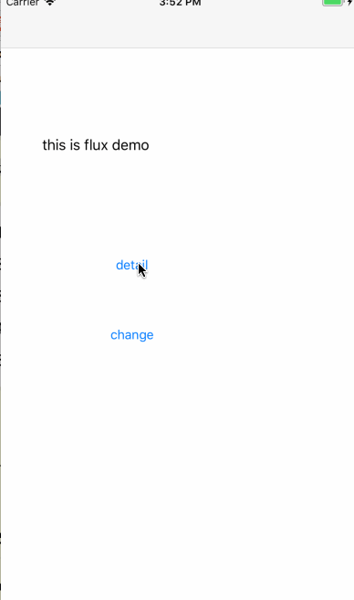

# Flux 

## 什么是Flux

https://facebook.github.io/flux/docs/dispatcher.html#content  
http://www.ruanyifeng.com/blog/2016/01/flux.html

Flux 的最大特点，就是数据的"单向流动"。

## 目前已经有的轮子

在UIKit的领域，基本关心的是，"一个状态变化"，映射到用户展示的变化响应。这种响应式方案，移动端已经有成熟的框架：rac 或者 rxjava。

就目前入手的几个项目来看，ioser对rac 使用的感觉是，过于随心所欲。notifactioncener+rac, RAC宏监听单例，内存不释放，任意点修改状态值，值变化，页面展示解耦后，带来的断点调试的困难。

总体来说，是一个很好的解决方案，但是坑也多，学习成本是有的。

## 为什么Flux 没有以上问题

1. 数据流是单向的。状态的change，有一个统一入口提交。
2. 不需要引入额外依赖或者框架，MVC和MVVM解决的代码组织结构方式，Flux关注的是，在实际开发中，状态变化-页面响应，应该是什么样式： 单向流动、极简。
3. Flux是一种思路。具体实现，可以有更多的方式。 joy it !

## demo

